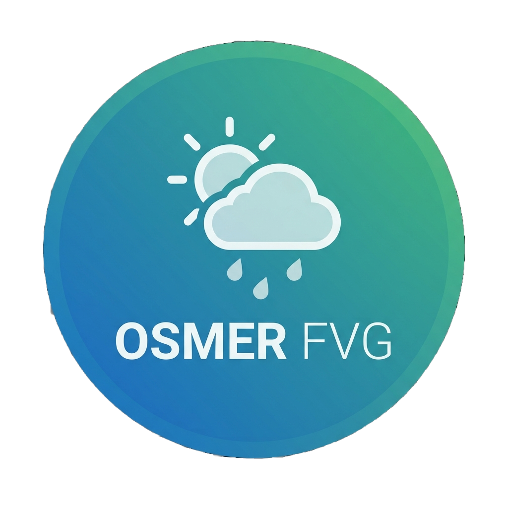

# OSMER FVG - Home Assistant Integration

  

Integrazione custom per **Home Assistant** che permette di monitorare le stazioni meteorologiche **OSMER FVG**  
(**Osservatorio Meteorologico Regionale del Friuli Venezia Giulia**).

L'integrazione utilizza le API pubbliche della Protezione Civile FVG e non richiede account o configurazioni esterne.

---

## Funzionalità

Attualmente supporta:

- 🌡️ Temperatura aria
- 💧 Umidità relativa
- 🌧️ Precipitazioni
- 🌊 Livello idrometrico
- 📍 Informazioni della stazione meteorologica
- 🔄 Aggiornamento automatico tramite API OSMER
- 🩺 Diagnostica Home Assistant

---

# Installazione

## Tramite HACS (consigliato)

1. Aprire Home Assistant
2. Andare in: HACS → integrazioni
3. Menu in alto a destra: 
4. Inserire: https://github.com/spoggesi/ha-osmer-fvg 
5. Installare **OSMER FVG**
6. Riavviare Home Assistant

## Installazione manuale

1. Copiare la cartella: custom_components/osmer_fvg, all'interno della cartella: config/custom_components/
2. Riavviare Home Assistant.

## Configurazione

Dopo il riavvio:
Impostazioni
→ Dispositivi e servizi
→ Aggiungi integrazione
→ OSMER FVG

Selezionare la stazione meteorologica desiderata.

---

# Sensori disponibili

Ogni stazione meteorologica crea automaticamente i sensori disponibili.

Esempio:

## OSMER Zuiano

| Sensore | Descrizione |
|---|---|
| Temperatura | Temperatura aria |
| Umidità | Umidità relativa |
| Pioggia | Precipitazione |
| Precipitazione 24 ore | Accumulo ultime 24 ore |
| Livello idrometrico | Altezza livello acqua |

---

# Dati e API

I dati sono forniti dal servizio pubblico:

**OSMER FVG - Protezione Civile Friuli Venezia Giulia**

https://monitor.protezionecivile.fvg.it

L'integrazione effettua interrogazioni periodiche tramite API pubbliche.

Non sono necessarie:

- API key
- Account utente
- Configurazioni lato server

---

# Requisiti

- Home Assistant >= 2024.1.0
- Connessione internet attiva
- Accesso alle API pubbliche OSMER FVG

---

# Screenshot

*(Screenshot disponibili nelle prossime versioni)*

---

# Diagnostica

L'integrazione supporta la funzione diagnostica nativa di Home Assistant.

È possibile recuperare informazioni su:

- stazione configurata
- sensori disponibili
- ultimi valori ricevuti
- timestamp aggiornamento dati

---

# Supporto

Per segnalazioni, richieste o suggerimenti:

https://github.com/spoggesi/ha-osmer-fvg/issues

---

# Licenza

Questo progetto è rilasciato sotto licenza MIT.